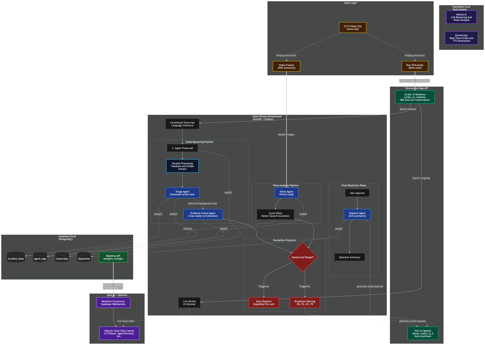

# DISPATCH — Multilingual Incident Intelligence

Emergency scenes are loud, chaotic, and multilingual. Bystanders shout in whatever language they speak. Cameras capture what no one reports. Today, all of this is lost.

**DISPATCH** is a multi-agent system that monitors scenes through CCTV video and ambient microphone — no phone calls, no 911 operators. ElevenLabs Scribe v2 transcribes a single audio stream into speaker-segmented, language-tagged intelligence in real time. Mistral Large triages severity, fuses audio evidence with Pixtral vision analysis, and recommends response actions. ElevenLabs TTS delivers evacuation warnings back to the scene in every detected language.

> Seven agents. Four languages. Two modalities. One shared case state. Every decision auditable.

---

## Demo Scenario

A vehicle collision unfolds in front of a surveillance camera. Four bystanders react in Spanish, English, Mandarin, and French. The system:

1. **Detects the crash** through both audio spike and visual scene change simultaneously
2. **Extracts a trapped occupant report** from Spanish
3. **Identifies a child-present alert** from Mandarin
4. **Receives a fire warning** from French — then cross-validates against vision detection of smoke and a HAZMAT placard
5. **Autonomously broadcasts trilingual evacuation** 21 seconds before an explosion

Zero casualties.

---

## Architecture



### Pipeline

```
CCTV Video File
  |
  +---> ffmpeg ---> Raw PCM Audio (16kHz mono)
  |                       |
  |                       v
  |                 ElevenLabs Scribe v2 Realtime
  |                 (WebSocket, 100ms chunks, 2x speed)
  |                       |
  |                 +-----+------+
  |                 |            |
  |            Partial      Committed Transcript
  |          (UI shimmer)   + Language Detection
  |                              |
  |                    +---------+---------+
  |                    |                   |
  |              Translate (||)      Intake Agent
  |             to English          Extract Facts
  |                    |                   |
  |                    +--------+----------+
  |                             |
  |                       Triage Agent
  |                   (severity, units, plan)
  |                             |
  |                    +--------+--------+
  |                    |                 |
  |              Dispatch           Evidence Fusion
  |            (instant cards)     (cross-modal, bg)
  |                                      |
  |                                Evacuation?
  |                                  /      \
  |                           Auto-Fire    TTS Broadcast
  |                           Dispatch     EN/ES/ZH/FR
  |
  +---> ffmpeg ---> Video Frames (every 3s)
                          |
                    Vision Agent
                   (Pixtral Large)
                          |
                    Scene Delta +
                    Hazard Escalation
                          |
                    Re-Triage + Fusion
```

### Agent Pipeline

| Agent | Model | Role | Latency |
|-------|-------|------|---------|
| **Intake** | `mistral-large-latest` | Extract structured facts from caller speech | ~1-2s |
| **Triage** | `mistral-large-latest` | Classify severity, recommend response units | ~1-2s |
| **Evidence Fusion** | `mistral-large-latest` | Cross-modal corroboration (audio + vision) | ~1-2s (bg) |
| **Dispatch** | `mistral-large-latest` | Generate unit briefs with callsigns and ETAs | ~2-3s (bg) |
| **Vision** | `pixtral-large-latest` | CCTV frame analysis — smoke, fire, collision, people | ~3-5s |
| **Translation** | `mistral-large-latest` | Real-time multilingual translation to English | ~1s |
| **TTS** | `eleven_turbo_v2_5` | Evacuation warnings in 4 languages | ~1s per lang |

### Data Flow

All agents write to **Supabase** (PostgreSQL). The **Next.js** frontend subscribes via Supabase Realtime WebSockets — zero polling.

| Table | Purpose | Realtime Events |
|-------|---------|-----------------|
| `incident_state` | Single source of truth — severity, units, hazards, timeline | UPDATE |
| `transcripts` | Speaker-segmented, language-tagged, translated | INSERT, UPDATE |
| `agent_logs` | Every agent decision, color-coded for terminal UI | INSERT |
| `dispatches` | Unit briefs with voice messages and ETAs | INSERT, UPDATE |
| `live_partials` | Partial transcripts for real-time UI shimmer | UPDATE |

---

## Latency Optimizations

- **Translate + Intake run in parallel** (asyncio.gather) — saves ~1s per transcript
- **Triage has zero tool calls** — evidence passed inline, single LLM round-trip
- **Dispatch placeholders inserted instantly** — green buttons appear before briefs are ready
- **All dispatch units generated in parallel** — not sequential
- **Vision starts at t=1s** with overlapping async API calls
- **Audio streams at 2x speed** — Scribe processes audio ahead of video playback
- **Fire-and-forget Supabase writes** — don't block the critical path

---

## Tech Stack

| Layer | Technology |
|-------|-----------|
| **LLM Reasoning** | [Mistral Large](https://mistral.ai) via Pydantic-AI |
| **Vision Analysis** | [Pixtral Large](https://mistral.ai) via Mistral SDK |
| **Speech-to-Text** | [ElevenLabs Scribe v2 Realtime](https://elevenlabs.io) (WebSocket) |
| **Text-to-Speech** | [ElevenLabs TTS](https://elevenlabs.io) (`eleven_turbo_v2_5`) |
| **Backend** | Python 3.12 + FastAPI + Pydantic-AI |
| **Database** | Supabase (PostgreSQL + Realtime) |
| **Frontend** | Next.js + TypeScript + Tailwind CSS |
| **Media** | ffmpeg (audio extraction, frame capture) |

---

## Project Structure

```
apps/
  server/              Python backend (FastAPI)
    src/
      agents/          Pydantic-AI agents (triage, intake, dispatch, vision, fusion)
      services/        Orchestrator, Scribe, TTS, media, state manager
      models/          Pydantic models (incident, triage, dispatch, vision)
      routes/          API endpoints (demo, health, report)
    assets/            Video files + generated audio (gitignored)

  web/                 Next.js frontend
    src/
      components/      Dashboard, CCTVPanel, TranscriptPanel, AgentTerminal,
                       ResponseLanes, CaseFilePanel, SeverityBadge
      hooks/           Supabase Realtime subscriptions
      lib/             Types, utilities, Supabase client

docs/                  Architecture diagrams, process docs
supabase/migrations/   Database schema
```

---

## Quick Start

### Prerequisites

- Python 3.12+ with [uv](https://github.com/astral-sh/uv)
- Node.js 18+
- ffmpeg installed
- API keys: Mistral, ElevenLabs, Supabase

### Backend

```bash
cd apps/server
cp .env.example .env   # Add your API keys
uv sync
uv run uvicorn src.main:app --reload
```

### Frontend

```bash
cd apps/web
npm install
cp .env.example .env.local   # Add Supabase URL + anon key
npm run dev
```

### Run Demo

1. Drop a video file (`.mp4`) into `apps/server/assets/`
2. Open `http://localhost:3000`
3. Click **Scenario 01 — Multi-Vehicle Collision**
4. Click **INITIATE FEED** to start audio/video analysis
5. Watch agents process in real time
6. Click **[BROADCAST]** when evacuation warnings appear
7. Click **[END SIM + REPORT]** to generate the after-action report

---

## Built With

<p align="center">
  <a href="https://mistral.ai"><strong>Mistral AI</strong></a> — LLM Reasoning + Vision Analysis
  &nbsp;&nbsp;&bull;&nbsp;&nbsp;
  <a href="https://elevenlabs.io"><strong>ElevenLabs</strong></a> — Real-Time Scribe + TTS Generation
</p>
