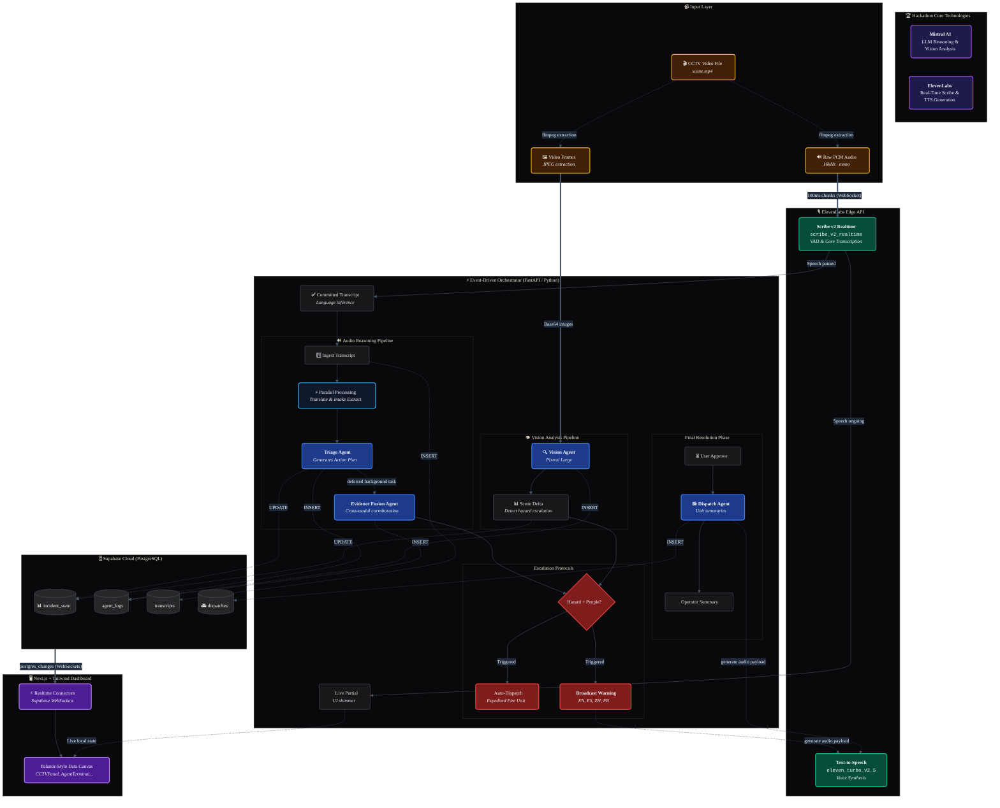

# TriageNet — Real-Time Emergency Dispatch System

```mermaid
%%{init: {
  'theme': 'base',
  'themeVariables': {
    'primaryColor': '#0a0a0a',
    'primaryTextColor': '#f8fafc',
    'primaryBorderColor': '#334155',
    'lineColor': '#475569',
    'secondaryColor': '#1e293b',
    'tertiaryColor': '#0f172a',
    'clusterBkg': '#09090b',
    'clusterBorder': '#27272a',
    'fontSize': '13px',
    'fontFamily': 'ui-monospace, SFMono-Regular, Menlo, Monaco, Consolas, monospace'
  }
}}%%
flowchart TB
    %% Styling Classes
    classDef sponsor fill:#1e1b4b,stroke:#a855f7,stroke-width:2px,color:#f8fafc,rx:6px,ry:6px
    classDef elevenlabs fill:#064e3b,stroke:#10b981,stroke-width:2px,color:#f8fafc,rx:6px,ry:6px
    classDef mistral fill:#1e3a8a,stroke:#3b82f6,stroke-width:2px,color:#f8fafc,rx:6px,ry:6px
    classDef supabase fill:#14532d,stroke:#22c55e,stroke-width:2px,color:#f8fafc,rx:6px,ry:6px
    classDef frontend fill:#4c1d95,stroke:#c084fc,stroke-width:2px,color:#f8fafc,rx:6px,ry:6px
    classDef critical fill:#7f1d1d,stroke:#ef4444,stroke-width:2px,color:#f8fafc,rx:6px,ry:6px
    classDef parallel fill:#0f172a,stroke:#38bdf8,stroke-width:2px,color:#f8fafc,rx:6px,ry:6px
    classDef input fill:#422006,stroke:#eab308,stroke-width:2px,color:#f8fafc,rx:6px,ry:6px
    classDef orchestrator fill:#18181b,stroke:#52525b,stroke-width:1px,color:#e4e4e7,rx:4px,ry:4px
    classDef internaldb fill:#27272a,stroke:#52525b,stroke-width:1px,color:#f8fafc,rx:10px,ry:10px

    %% SPONSORS
    subgraph SPONSORS["🏆 Hackathon Core Technologies"]
        direction LR
        MISTRAL_SPONSOR["<b>Mistral AI</b><br/>LLM Reasoning &<br/>Vision Analysis"]:::sponsor
        ELEVENLABS_SPONSOR["<b>ElevenLabs</b><br/>Real-Time Scribe &<br/>TTS Generation"]:::sponsor
    end

    %% INPUT
    subgraph INPUT["📹 Input Layer"]
        direction LR
        VIDEO["🎬 CCTV Video File<br/><i>scene.mp4</i>"]:::input
        PCM["🔊 Raw PCM Audio<br/><i>16kHz · mono</i>"]:::input
        FRAMES["🖼️ Video Frames<br/><i>JPEG extraction</i>"]:::input
        VIDEO -.->|"ffmpeg extraction"| PCM
        VIDEO -.->|"ffmpeg extraction"| FRAMES
    end

    %% ELEVENLABS
    subgraph ELEVENLABS["🎙️ ElevenLabs Edge API"]
        direction TB
        SCRIBE["<b>Scribe v2 Realtime</b><br/><code>scribe_v2_realtime</code><br/><i>VAD & Core Transcription</i>"]:::elevenlabs
        TTS["<b>Text-to-Speech</b><br/><code>eleven_turbo_v2_5</code><br/><i>Voice Synthesis</i>"]:::elevenlabs
    end

    %% CORE ORCHESTRATOR
    subgraph ORCHESTRATOR["⚡ Event-Driven Orchestrator (FastAPI / Python)"]
        direction TB
        
        PARTIAL["💬 Live Partial<br/><i>UI shimmer</i>"]:::orchestrator
        COMMITTED["✅ Committed Transcript<br/><i>Language inference</i>"]:::orchestrator
        
        subgraph AUDIO_PIPELINE["🔊 Audio Reasoning Pipeline"]
            direction TB
            RAW_INSERT["1️⃣ Ingest Transcript"]:::orchestrator
            PARALLEL_1["⚡ Parallel Processing<br/><i>Translate & Intake Extract</i>"]:::parallel
            TRIAGE["🚨 <b>Triage Agent</b><br/><i>Generates Action Plan</i>"]:::mistral
            FUSION_BG["🔗 <b>Evidence Fusion Agent</b><br/><i>Cross-modal corroboration</i>"]:::mistral
            
            RAW_INSERT --> PARALLEL_1 --> TRIAGE -.->|"deferred background task"| FUSION_BG
        end

        subgraph VISION_PIPELINE["👁️ Vision Analysis Pipeline"]
            direction TB
            VISION_AGENT["🔍 <b>Vision Agent</b><br/><i>Pixtral Large</i>"]:::mistral
            VISION_DELTA["📊 Scene Delta<br/><i>Detect hazard escalation</i>"]:::orchestrator
            VISION_AGENT --> VISION_DELTA
        end

        subgraph ACTIONS["🚨 Escalation Protocols"]
            direction TB
            EVAC_CHECK{"Hazard + People?"}:::critical
            EVAC_DISPATCH["🚒 Auto-Dispatch<br/><i>Expedited Fire Unit</i>"]:::critical
            EVAC_TTS["📢 <b>Broadcast Warning</b><br/><i>EN, ES, ZH, FR</i>"]:::critical
            
            EVAC_CHECK -->|"Triggered"| EVAC_DISPATCH
            EVAC_CHECK -->|"Triggered"| EVAC_TTS
        end
        
        subgraph TERMINAL["📝 Final Resolution Phase"]
            direction LR
            APPROVAL["⏳ User Approve"]:::orchestrator
            DISPATCH_AGENT["📻 <b>Dispatch Agent</b><br/><i>Unit summaries</i>"]:::mistral
            SUMMARY["📄 Operator Summary"]:::orchestrator
            
            APPROVAL --> DISPATCH_AGENT --> SUMMARY
        end
        
        FUSION_BG --> EVAC_CHECK
        VISION_DELTA --> EVAC_CHECK
    end
    
    PCM ==>|"100ms chunks (WebSocket)"| SCRIBE
    FRAMES ==>|"Base64 images"| VISION_AGENT
    SCRIBE -->|"Speech ongoing"| PARTIAL
    SCRIBE -->|"Speech paused"| COMMITTED
    COMMITTED --> RAW_INSERT
    EVAC_TTS -.->|"generate audio payload"| TTS
    DISPATCH_AGENT -.->|"generate audio payload"| TTS

    %% DATABASE
    subgraph SUPABASE["🗄️ Supabase Cloud (PostgreSQL)"]
        direction LR
        DB_STATE[("📊 incident_state")]:::internaldb
        DB_LOGS[("📝 agent_logs")]:::internaldb
        DB_TRANSCRIPTS[("💬 transcripts")]:::internaldb
        DB_DISPATCHES[("🚑 dispatches")]:::internaldb
    end

    %% DB Connections
    RAW_INSERT -.->|"INSERT"| DB_TRANSCRIPTS
    TRIAGE -.->|"UPDATE"| DB_STATE
    VISION_DELTA -.->|"UPDATE"| DB_STATE
    TRIAGE -.->|"INSERT"| DB_LOGS
    VISION_AGENT -.->|"INSERT"| DB_LOGS
    DISPATCH_AGENT -.->|"INSERT"| DB_DISPATCHES
    FUSION_BG -.->|"INSERT"| DB_LOGS

    %% FRONTEND
    subgraph FRONTEND["🖥️ Next.js + Tailwind Dashboard"]
        direction TB
        HOOKS["⚡ Realtime Connectors<br/><i>Supabase WebSockets</i>"]:::frontend
        UI["🎨 Palantir-Style Data Canvas<br/><i>CCTVPanel, AgentTerminal...</i>"]:::frontend
        HOOKS --> UI
    end

    SUPABASE ==>|"postgres_changes (WebSockets)"| HOOKS
    PARTIAL -.->|"Live local state"| UI
```
